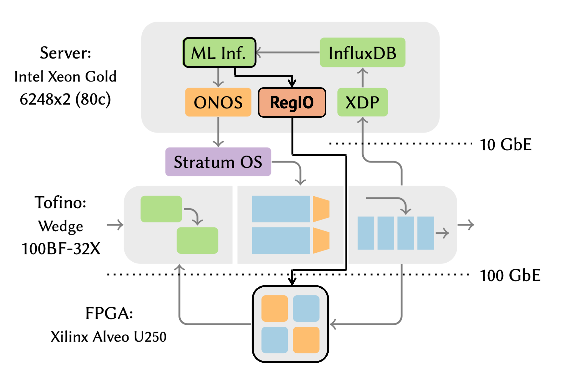

# Caravan FPGA+P4 Testbed

Here, we provide the code to set up and run the testbed-based evaluation for Caravan. The testbed is based on the [Taurus Anomaly Detection ASPLOS22](https://gitlab.com/dataplane-ai/taurus/applications/anomaly-detection-asplos22) artifact. Hence, when running the intrusion-detection application using our Caravan architecture, we expect the user to have access to a testbed shown in the figure, below.

> **Note for AE reviewers:** This folder is not part of the OSDI 2024 artifact evlaution.



* `spatial/`: contains the intrusion-detection spatial code to compile the FPGA bitstream.

* `software/`: contains the control-plane code for monitoring and updating the in-network ML model running on the FPGA.

* `sendrecv/`: contains the code for the packet sender and receiver for traffic generation.

* `open-nic.patch`: needed to patch the Xilinx open-nic-shell---one of the dependencies of the Taurus testbed (referenced above). For running the patch, follow the commands below:
```
cp ./open-nic.patch <path-to-taurus-mapreduce>/deps/open-nic;
cd <path-to-taurus-mapreduce>/deps/open-nic;
git apply open-nic.patch
```
